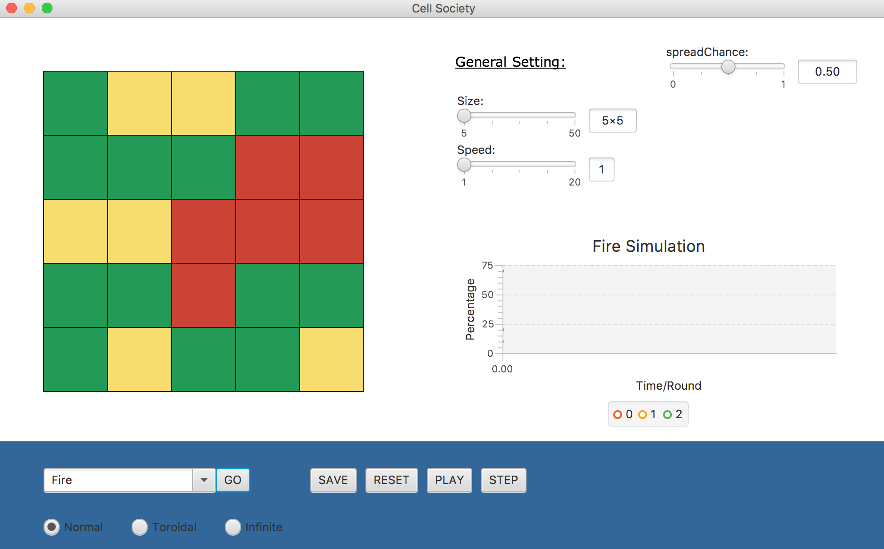
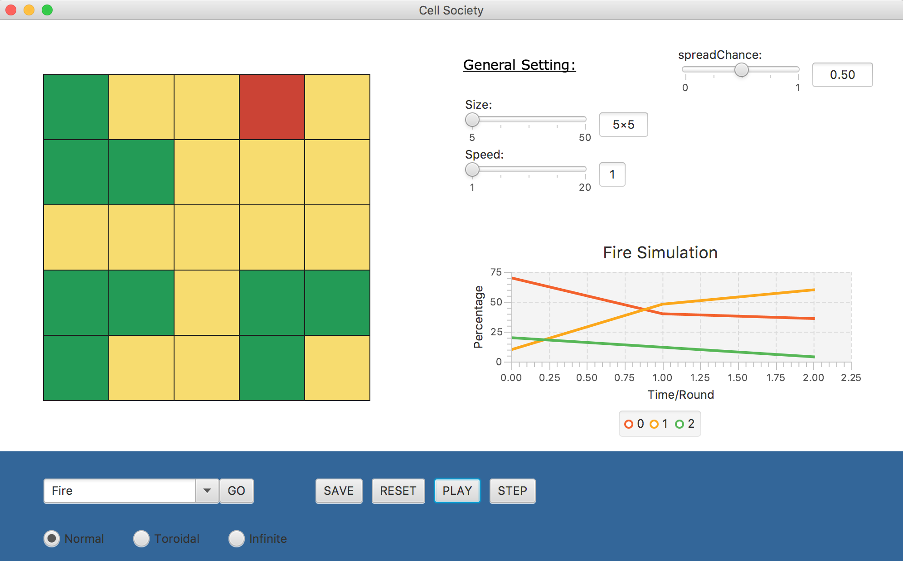
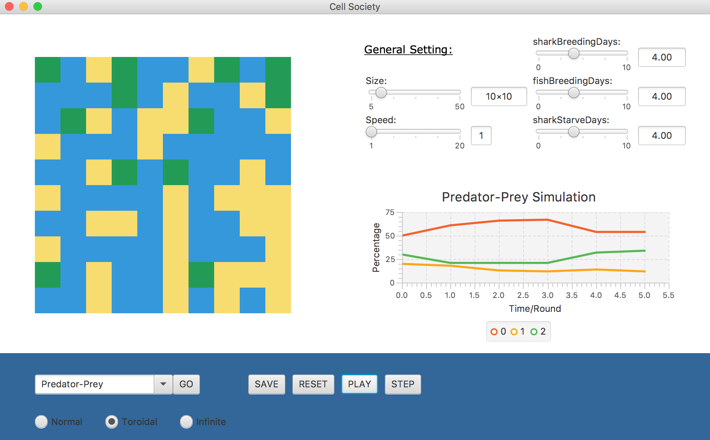

# cellsociety

CompSci 308 Cell Society Project
Ben Welton, Heyao Yang, Nathan Lewis

### Each Person's Role
As a smaller team of 3, at different points in development we were all able to contribute to different parts of the project, however most of the work completed was done within our specific role.
Ben handled the XML aspect of the program, designing the files, the handler and many other additional tasks it involved, such as linking it to the Simulation. He also played a big role in implementing the complex algorithms behind the different Simulations we included in our program and other general back-end tasks that were essential to his work.
Heyao formed almost the entirety of the front-end of this project, initializing the layout and handling all other interactive parts displayed on the screen, from the dynamic grid itself to the graph displaying population. At times Heyao also ventured into the back-end of the program and made alterations where necessary to his work.
Nathan's role consisted mostly of back-end work, creating classes associated with the Grid and Cells which would be used by the simulations and also contributing to some algorithms used by the simulations also. He also took on the main of integrating the front end with the back end, debugging where necessary and working with other members of the group, everyone also had some experience doing this at different points as well.

### Resources Used
* Many specific questions answered on StackOverflow
* www.java2s.com/Tutorials/
* https://www.gamedev.net/blogs/entry/2249737-another-cellular-automaton-video/
* http://cs.gmu.edu/~eclab/projects/mason/publications/alife04ant.pdf
* http://nifty.stanford.edu/2014/mccown-schelling-model-segregation/
* http://nifty.stanford.edu/2011/scott-wator-world/
* http://nifty.stanford.edu/2007/shiflet-fire/
* http://web.stanford.edu/~cdebs/GameOfLife/

### Information about using the program
We hope we have produced quite a user-friendly interface for using our program. We have a drop down menu where you can choose your simulation type and radio buttons beneath where you can pick which grid type you want to use. Having initialized this information, pressing 'Go' will launch the simulation on the screen. There are sliders to the right of the displayed grid which have multiple different functions. The size and speed of the program can be changed at any time by using those sliders and depending on which simulation you choose, the appropriate sliders will appear to the right which allow you to take control of specific variables in the simulation e.g. the probability of fire spreading in the fire simulation. 
	Using the controls in the bottom pane of the program you can play the program at the specified speed, pause it after pressing play, step through the simulation once at a time by pressing step or reset the simulation entirely. If you want control of the simulation, at any time you can click on a cell to change the state/color of it; continue to click to cycle through all the possible states for that simulation. You can also change the XML files that exist in our data resources to change the specific beginning layout and save the current layout of the grid to an XML file - this layout can then be retrieved in the drop down menu by clicking 'Saved State' and the simulation will continue.
	

### Files
The file Main.java is used to start the program.
The majority of testing our files was done using the front-end visualization with the classes within the GUI package.
The XML file specifics are described below.

####XML Permutations
* Grids: `<Grid></Grid>`
	* Grid lines--`<Visible>true|false</Visible>` 
	* Grid size--`<Size>Integer</Size>`
	* Grid type--`<Type>Normal|Torodial|Infinite</Type>`

* Cells: `<Cells><Cell></Cell></Cells>`
	* Specific layout: `<Layout><Row>stringofints</Row><Layout>`
	* Probability distribution: `<Cell proportion="0-100"></Cell>`
	* Color: `<Cell color="#hexcode"></Cell>`